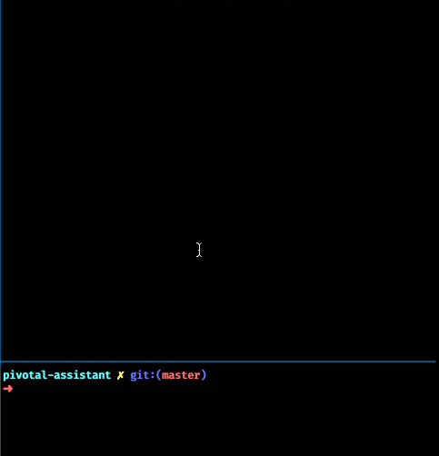

# pivotal-assistant

Command line pivotal tracker viewer (ideal when using tmux)

## Features:

- Opens story of current git branch (if branch name contains story id)
- Show story info, labels
- Update story state
- Show / edit / complete / delete tasks
- Show / add comments



## Setup

```sh
npm install -g pivotal-assistant
```

in the root of your project:

```sh
pivotal-assistant
```

use arrow keys or vi keys or mouse to control.

use `q` to quit

## Keys:

In taskscreen:

- use 'x' to complete task
- use 'D' to delete task
